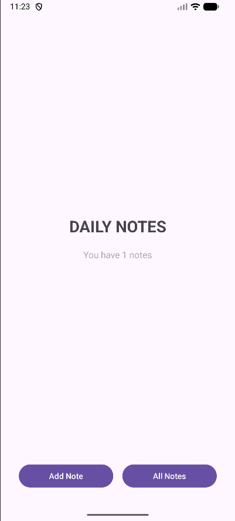
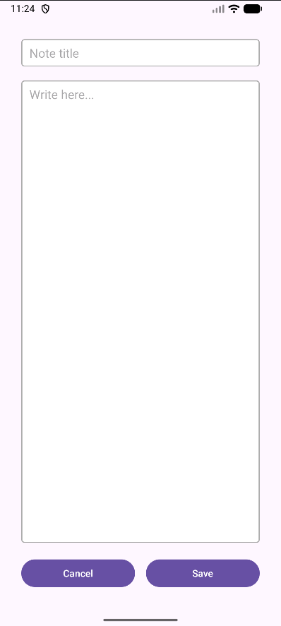
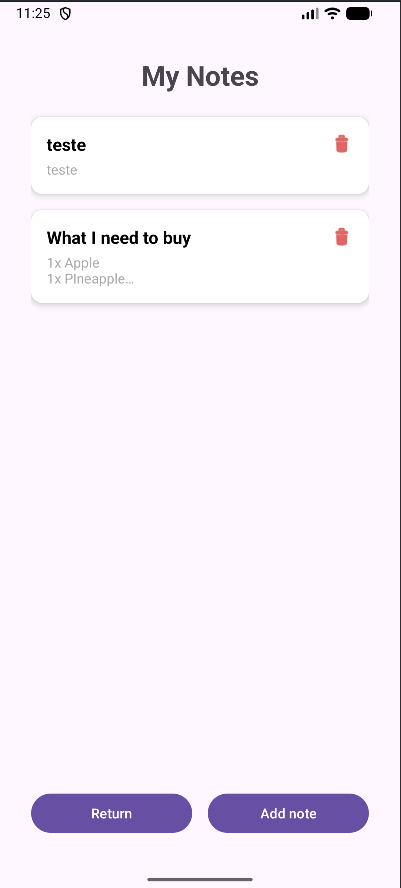

# 📝 Daily Notes App

A simple Android app for creating, viewing, and deleting text notes — all stored locally as `.txt` files.

  

---

## 🚀 Features

- Create and save notes
- View and read notes
- Delete notes easily
- Local file storage (no database)

---

## ⚙️ Tech Stack

- Kotlin
- XML + ViewBinding
- RecyclerView
- Local file system

---

## 📂 Storage Path

/storage/emulated/0/Android/data/com.github.devlusk.dailynotesapp/files/notes

Each note is stored as a `.txt` file with its title and content.

---

## 📸 Screenshots

| Home | Create | Notes |
|------|---------|--------|
|  |  |  |

